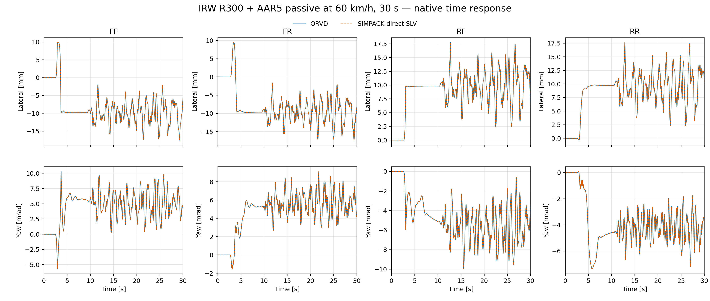
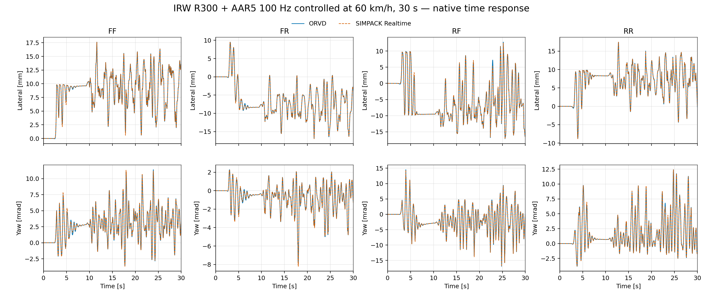
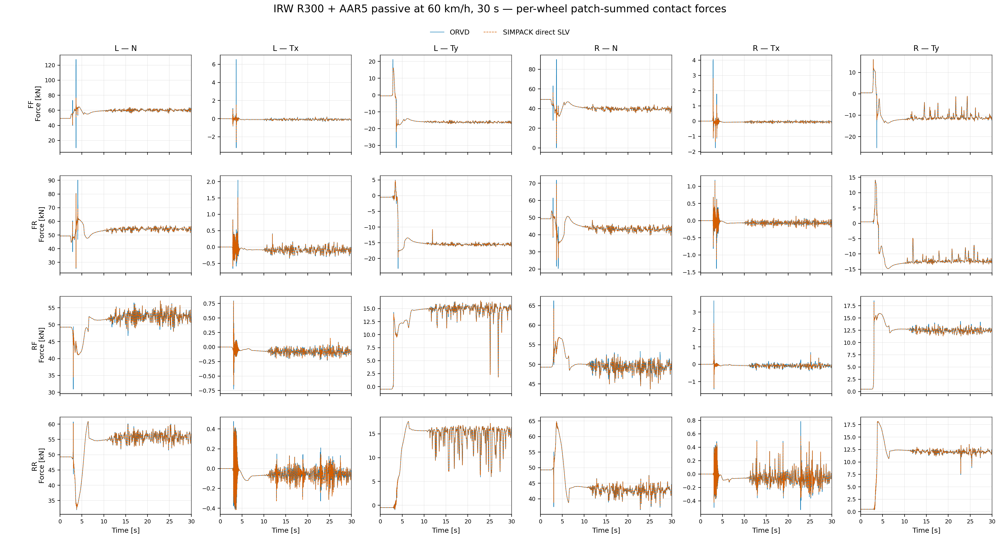
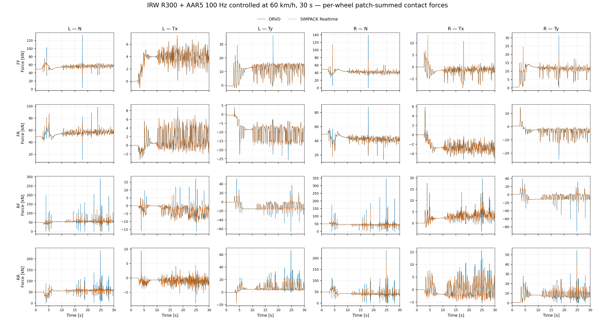

# OpenRailVehicleDynamics (ORVD)

> 首款面向完整轨道车辆的端到端开放源码 C++23 动力学平台：贯通线路、轮轨、多体与控制，原生运行于 Linux／Windows，并在整车对标中验证了实时级吞吐。

OpenRailVehicleDynamics 把三维线路、轨道不平顺、轮轨接触、车辆多体系统、悬挂与作动、
采样控制和时间积分连接为一条透明的计算链。研究者可以从严格 JSON 资产装配完整车辆，计算
车体与轮对运动、逐轮接触斑、三向轮轨力、蠕滑率和控制事件，并通过安装后的 CMake 目标把这些
能力嵌入自己的程序。

ORVD 随包提供刚性轮对 GZ18 与独立旋转车轮 IRW 两类车辆模型，并在直线、曲线、随机不平顺、
被动运行和闭环控制长窗中与 SIMPACK 逐时序比较。项目同时具备可重定位安装、离线依赖
构建、确定性轮轨并行，以及 Linux／Windows 的 GCC 与 Clang 双工具链验证。

## 从线路输入到闭环车辆响应


整条计算链以双精度状态运行。线路层负责三维姿态和站位，轮轨层把型面与轨道激励转换为接触斑
及扳手，多体层形成连续状态右端，CVODE 完成自适应 BDF 推进和稠密输出；周期控制事件在接受态上
原子提交，再进入下一段动力学。

## 核心能力

| 领域 | 已实现能力 |
|---|---|
| 多体动力学 | 刚体树装配、位置／速度运动学、质量矩阵、逆动力学、前向动力学、外力投影、复合连续状态与缓存运行时 |
| 三维线路 | 平面曲率、超高、恒坡、抛物线竖曲线、严格投影圆弧竖曲线、五次接缝及其三维耦合；支持局部站位投影与边界切线延长 |
| 轨道不平顺 | 冻结空间点列与可复核 AAR5／AAR6 空间谱生成；随包提供 AAR5、AAR6 和 ERRI low 横／垂向资产 |
| 轮轨接触 | 等弧长型面预处理、轮轨外形插值、多接触斑几何、EEC 法向力、Kalker 系数、FASTSIM 切向力与逐斑蠕滑率 |
| 车辆力元 | 平动弹簧阻尼、串联弹簧黏性阻尼、饱和分段阻尼、侧滚元、六分量衬套、重力和八路轮轨扳手 |
| 控制与作动 | 全状态轮速导向、纵向巡航控制与转矩调理 |
| 数值执行 | CVODE BDF、逐分量容差、稠密数值 Jacobian、并行 Jacobian 列、真实稠密输出、接受态事务与按实例冻结的积分配方 |
| 并行与确定性 | 八个轮轨接口独占工作区的 OpenMP 批计算；固定槽发布、无跨轮浮点归约，并验证真实多线程团队 |
| 工程交付 | 严格 JSON 加载、可重定位 CMake 安装、位置无关静态归档、离线依赖源码包及普通程序／进程内共享模块消费 |

随包线路库覆盖直线、R300、R600、R800、R1000，以及同时包含平面曲线、超高和竖向剖面的线路。
IRW 被动场景入口覆盖 `60 / 80 / 100 / 120 / 160 / 200 km/h`，可组合 AAR5、AAR6 与 ERRI low
不平顺，用于观察速度、曲率和激励共同变化时的动力学响应。

## 双车型整车验证

SIMPACK 承担整车参考。下面的时序图保留两端原生时钟；误差统计在未移时的共同时间点上计算，
不滤波、不去均值，也不通过滞后来压低误差。轮轨力先按车轮汇总同一时刻的全部接触斑；均方根
在全部车轮与共同时刻上池化，最大差取同一集合的全局最大值。GZ18 的共同统计步长为 `0.5 ms`，
IRW 为 `10 ms`。轮轨力图统一展示全部车轮的 `N/Tx/Ty` 原生时序；蓝色实线为 ORVD，橙色虚线
为 SIMPACK。

| 车辆 | 机械拓扑 | 对标工况 | 参考求解 |
|---|---|---|---|
| GZ18 | 17 体、四个刚性轮对 | 直线＋AAR6，60 km/h，20 s | SIMPACK 直接求解 |
| GZ18 | 17 体、四个刚性轮对 | R300＋AAR5，60 km/h，16 s | SIMPACK 直接求解 |
| IRW | 四轴桥、八个独立旋转车轮 | R300＋AAR5，零转矩被动，60 km/h，30 s | SIMPACK 直接求解 |
| IRW | 四轴桥、八个独立旋转车轮 | R300＋AAR5，100 Hz 全状态受控，60 km/h，30 s | SIMPACK Realtime |

### GZ18：刚性轮对车辆

GZ18 的 109 维连续状态覆盖整车、两个构架、四个刚性轮对、悬挂力元和八个轮轨接口。直线工况
检验随机不平顺下的四轮对响应；R300 工况进一步叠加曲率、中心线超高和轮轨横向稳态载荷。

#### 直线＋AAR6

四个轮对在 AAR6 激励下的横移、摇头幅值和相位由两套求解器共同复现；不平顺退出后，衰减过程
也保持同步。


#### R300＋AAR5

进入 R300 曲线后的稳态偏置、前后转向架差异和 AAR5 激励响应在四个轮对上保持一致，说明线路
几何、超高、型面和车辆动力学已经在同一时序中闭合。


#### 对标精度总览

表内依次为均方根／最大差；运动学均方根给出四轮对范围。

| 工况 | 横移（µm） | 摇头（µrad） | `N`（kN） | `Tx`（kN） | `Ty`（kN） |
|---|---:|---:|---:|---:|---:|
| 直线＋AAR6 | `15.16–19.02 / 66.08` | `5.20–6.57 / 33.37` | `0.654 / 12.319` | `0.080 / 1.616` | `0.055 / 1.348` |
| R300＋AAR5 | `7.42–8.94 / 56.76` | `3.73–5.46 / 40.18` | `0.540 / 22.374` | `0.105 / 4.129` | `0.115 / 4.881` |

R300 工况的力最大差集中在 AAR5 淡入段的轮轨力点状尖峰；均方根显示完整时序中的主体响应仍
保持亚千牛级差异。

<details>
<summary><strong>展开查看 GZ18 全轮三向轮轨力对照</strong></summary>

**直线＋AAR6**


**R300＋AAR5**


</details>

### IRW：独立旋转车轮车辆

IRW 的 157 维连续状态包含四个轴桥和八个独立旋转车轮。它没有刚性轮对提供的轮速约束，轮缘—
钢轨边界、轨道不平顺和主动轮速导向会形成与传统轮对车辆明显不同的动力学模态。

#### 零转矩被动运行

八个车轮全程不给驱动转矩。图中展示独立车轮在 R300 曲线和 AAR5 激励下形成的四轴桥横移与摇头
响应，以及 ORVD 与 SIMPACK 对自然演化过程的复现程度。



#### 100 Hz 全状态受控

同一车辆接入全状态轮速导向与转矩调理后，图中展示闭环介入后形成的车辆响应。



#### 对标精度总览

表内依次为均方根／最大差；运动学均方根给出四轴桥范围。

| 工况 | 横移（mm） | 摇头（mrad） | `N`（kN） | `Tx`（kN） | `Ty`（kN） |
|---|---:|---:|---:|---:|---:|
| 零转矩被动 | `0.010–0.023 / 0.366` | `0.015–0.023 / 0.236` | `0.169 / 13.667` | `0.030 / 1.665` | `0.077 / 8.497` |
| 100 Hz 全状态受控 | `0.095–0.373 / 3.414` | `0.077–0.240 / 1.691` | `3.651 / 154.641` | `0.441 / 11.816` | `1.044 / 38.017` |

零转矩被动工况的横移与摇头均方根分别不超过 `0.023 mm` 和 `0.023 mrad`；闭环工况的宏观演化
仍能逐轴复现，但轮轨力的离散尖峰差异更显著。

<details>
<summary><strong>展开查看 IRW 全轮三向轮轨力对照</strong></summary>

**零转矩被动**



**100 Hz 全状态受控**



</details>

## 计算性能

动力学推进墙钟只计算 CVODE、车辆右端和接受态事务；完整进程还包含观测重放、端点诊断、结果组织
和写出。实时系数为仿真时长除以推进／控制墙钟。

| 工况 | 仿真时长 | ORVD 推进／控制 | 实时系数 | ORVD／SIMPACK 完整进程 | ORVD 完整进程加速比 |
|---|---:|---:|---:|---:|---:|
| GZ18 直线＋AAR6 | `20 s` | `19.326 s` | `1.035×` | `25.88 / 60.13 s` | `2.32×` |
| GZ18 R300＋AAR5 | `16 s` | `14.769 s` | `1.083×` | `20.51 / 48.14 s` | `2.35×` |
| IRW 零转矩被动 | `30 s` | `25.312 s` | `1.185×` | `32.01 / 38.28 s` | `1.20×` |
| IRW 100 Hz 全状态受控 | `30 s` | `32.587 s` | `0.921×` | `38.91 / 154.37 s` | `3.97×` |

四项工况中有三项的核心推进超过实时，IRW 闭环计算也达到 `0.921×`。完整进程同时计入两端的
模型载入、结果组织和写出；四项工况均由 SIMPACK 与 ORVD 串行执行。

## 验证体系

ORVD 以三层相互独立的证据建立模型与实现资格：

| 层级 | 验证内容 |
|---|---|
| 解析与物理性质 | 刚体变换、运动学、质量矩阵、逆／前向动力学、轨道几何、接触、控制递推和 CVODE 解析系统 |
| 多体算子参照 | 通过跨进程 Drake 参考程序核对位置、速度、微分运动学、质量矩阵、逆／前向动力学和外力 |
| 整车时序参照 | 通过 SIMPACK 核对刚性轮对、独立车轮、被动运行和 100 Hz 闭环控制的原生车辆响应 |

当前完整测试集合为：

| 平台 | 工具链 | 完整测试 |
|---|---|---:|
| Ubuntu | GCC 13；Clang 20＋LLVM libomp | `81/81` |
| Windows 10 | MSYS2 UCRT64 GCC；CLANG64 Clang＋LLVM libomp | `79/79` |

平台测试包含真实 OpenMP 团队探针、可重定位安装消费者、普通依赖闭包和共享 Drake 排除门。
八轮接触的固定槽结果不随工作者数量变化；并行执行仍必须实际形成多线程团队。

## 构建、安装与消费

ORVD 依赖 Eigen 3.4.0、fmt 9.1.0、nlohmann/json 3.12.0、OpenMP C++ 运行时和 SUNDIALS 7.7.0。
已有依赖前缀时可以直接构建和安装：

```bash
cmake -S . -B build -G Ninja \
  -DCMAKE_BUILD_TYPE=Release \
  -DCMAKE_PREFIX_PATH=<dependency-prefix> \
  -DCMAKE_INSTALL_PREFIX=<orvd-prefix> \
  -DBUILD_TESTING=OFF
cmake --build build
cmake --install build
```

外部工程通过标准 CMake 包消费：

```cmake
find_package(OpenRailVehicleDynamics CONFIG REQUIRED)
target_link_libraries(my_vehicle_simulation PRIVATE ORVD::integrators)
```

安装包导出 11 个按依赖层级组织的目标：`control`、`actuation`、`track_geometry`、
`track_irregularity`、`wheel_rail_contact`、`configuration`、`multibody_runtime`、
`multibody_model`、`forces`、`system_assembly` 与 `integrators`，使用时添加 `ORVD::` 命名空间。

无需系统开发包的离线依赖构建、Windows 工具链和完整测试命令见
[依赖与安装说明](distribution/dependencies/README.md)。架构决策与共享模块消费边界见
[安装归档决策](docs/adr/0008-build-installed-archives-for-shared-module-consumers.md)。

## 仓库导航

| 入口 | 内容 |
|---|---|
| [`libs/`](libs/) | 可安装的 C++ 产品模块与公共头 |
| [`vehicle_library/`](vehicle_library/) | GZ18、IRW 机械模型、移动启动、轮型、作动及参考模型 |
| [`track_library/`](track_library/) | 线路几何、钢轨型面和轨道不平顺资产 |
| [`controller_library/`](controller_library/) | IRW 全状态导向、巡航控制与转矩调理参数 |
| [`experiments/`](experiments/) | 可复用的实验编排、结果提取与绘图示例 |
| [`tools/`](tools/) | 动力学资格、型面转换、打包和源码边界工具 |
| [`tests/`](tests/) | 解析、性质、跨实现、安装和平台测试 |
| [`docs/`](docs/) | 模型算法、架构决策、工程规则和性能说明 |

## 文档入口

- [模型与算法](docs/models_and_algorithms/README.md)：轨道几何、不平顺、轮轨接触、车辆动力学、
  控制与数值方法。
- [轨道竖向剖面与三维耦合](docs/models_and_algorithms/track_geometry/TRACK_VERTICAL_PROFILE_MODELLING.md)：
  恒坡、抛物线、严格投影圆弧竖曲线及其与平面曲线和超高的组合。
- [轨道不平顺谱](docs/models_and_algorithms/track_irregularity_spectra/TRACK_IRREGULARITY_SPECTRA.md)：
  空间频率、AAR 工程谱、随机实现和资格方法。
- [架构决策](docs/adr/README.md)：运行时、积分器、轮轨并行、控制事件与交付边界。
- [第一方工程规则](docs/engineering/FIRST_PARTY_ENGINEERING_RULES.md)：命名、输入、热路径和验收纪律。
- [IRW 多速度直接求解示例](experiments/irw_passive_multispeed_simpack_slv_comparison/README.md)：
  多速度、多曲率和多种不平顺下的 SIMPACK／ORVD 编排与响应分析。
- [完整文档索引](docs/README.md)。

## 许可

第一方代码允许非盈利用户使用、修改与再分发；商业生产使用需要另行授权。计划中的正式许可为
初期 BSL 1.1，并在三年后统一转为 Apache-2.0。

vendored Drake 源码遵循其 BSD-3-Clause 与逐文件注明的 Apache-2.0 条款；第三方来源、修改声明和
再分发信息见 [`NOTICE`](NOTICE) 与 [vendored 源码说明](external/drake_mbtree/README.md)。
