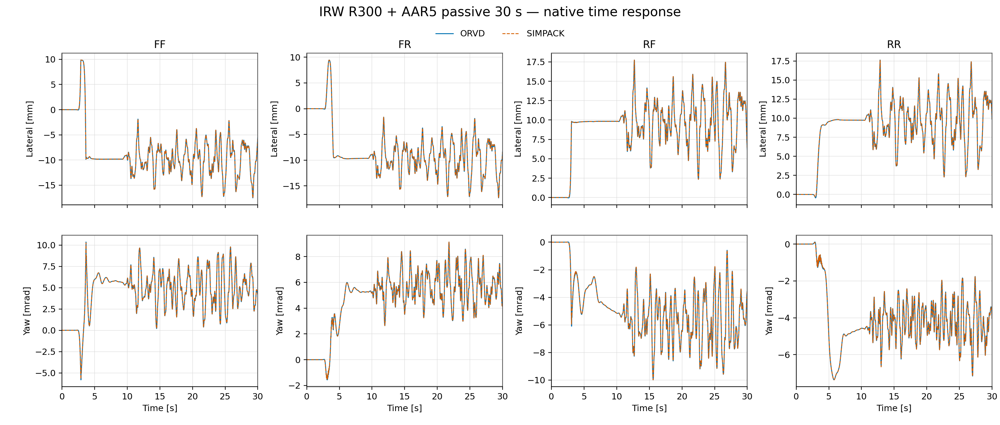
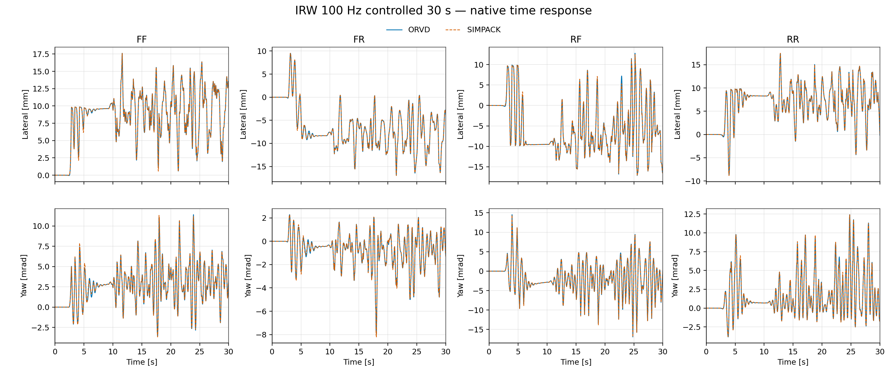
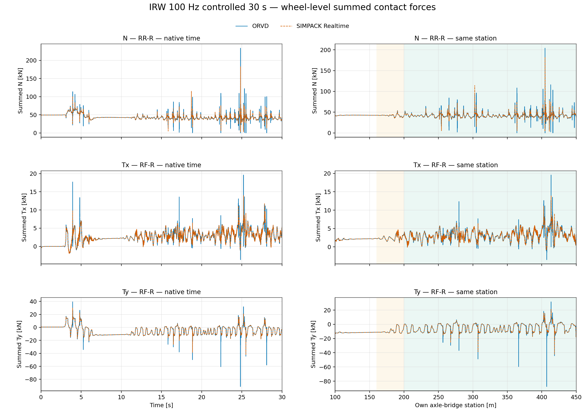

# OpenRailVehicleDynamics (ORVD)

ORVD 是面向轨道车辆的 C++23 双精度刚性多体动力学库，提供多体模型装配、运动学、质量矩阵、
逆动力学与前向动力学、外力投影、复合连续状态，以及基于 CVODE 的时域积分；同时提供严格 JSON
配置和可安装的 CMake 包。产品运行时不链接外部 `libdrake`。轨道车辆功能包括轨道几何与站位投影、
轮轨型面处理、轮轨接触几何、EEC 法向接触、Kalker/FASTSIM 切向接触、悬挂与车辆力元、轨道不平顺，
以及八个轮轨接口的确定性 OpenMP 并行计算。

## 目录结构

```text
OpenRailVehicleDynamics/
├── CMakeLists.txt        顶层构建与安装入口
├── CMakePresets.json     开发、发布与 Drake 参考构建预设
├── cmake/                CMake 辅助模块
├── distribution/         离线依赖源码包与超级构建模板
├── docs/
│   ├── models_and_algorithms/ 物理模型、数学关系、算法语义与参考实现比较
│   ├── planning/         实施路书、决策账本与观察记录
│   ├── performance/      计算性能路书与专项研究档案
│   ├── adr/              架构决策记录
│   ├── design/           软件架构、运行时契约与早期设计输入
│   └── engineering/      第一方工程约束
├── external/
│   └── drake_mbtree/     vendored 刚性多体树源码、替代实现与许可证
├── libs/
│   ├── track_geometry/    轨道几何、轨道坐标系与站位投影
│   ├── wheel_rail_contact/ 型面、接触几何、法向／切向接触与工作区
│   ├── configuration/     严格 JSON 加载、车辆与初始状态装配
│   ├── multibody_runtime/ 多体状态、缓存与求值运行时
│   ├── multibody_model/   模型中立的多体建模接口
│   ├── control/           状态显式的采样控制算法
│   ├── actuation/         状态显式的转矩指令调理算法
│   ├── forces/            车辆力元与轮轨接触力计划
│   ├── system_assembly/   系统装配与计算计划
│   └── integrators/       连续状态推进接口与 CVODE 后端
├── tools/
│   ├── dynamics_qualification/ 长窗动力学资格运行器（不安装）
│   ├── profile_conversion/     JSON 与 SIMPACK 型面格式转换工具（不安装）
│   └── drake_source_boundary/  Drake 源码边界检查工具
├── track_library/         轨道几何、轨型与轨道不平顺 JSON 资产
├── controller_library/    按控制人格组织的严格 JSON 资产
├── vehicle_library/       按车型组织的机械、启动、轮型、作动资产与 SIMPACK 参考模型
│   ├── gz18/              GZ18 车型资产与参考模型
│   └── irw/               IRW 车型、H3 启动、S1002 轮型、作动资产与参考模型
└── tests/                 单元、系统、安装与跨实现验证
```

公共头位于 `libs/<module>/include/orvd/<module>/`，实现位于相邻的 `src/`。安装包导出
`ORVD::control`、`ORVD::actuation`、`ORVD::track_geometry`、`ORVD::wheel_rail_contact`、`ORVD::configuration`、
`ORVD::multibody_runtime`、`ORVD::multibody_model`、`ORVD::forces`、
`ORVD::system_assembly` 与 `ORVD::integrators`；vendored Drake 类型和开发期工具不安装。

## 构建与安装

构建依赖为 Eigen 3.4.0、fmt 9.1.0、nlohmann/json 3.12.0、OpenMP C++ 运行时和 SUNDIALS 7.7.0。
已有依赖可通过标准 CMake 搜索前缀提供；缺失时配置失败。

已有依赖前缀时可直接安装并由外部工程消费：

```bash
cmake -S . -B build -G Ninja \
  -DCMAKE_BUILD_TYPE=Release \
  -DCMAKE_PREFIX_PATH=<dependency-prefix> \
  -DCMAKE_INSTALL_PREFIX=<orvd-prefix> \
  -DBUILD_TESTING=OFF
cmake --build build
cmake --install build
```

外部 CMake 工程使用 `find_package(OpenRailVehicleDynamics CONFIG REQUIRED)`，按所需最高层链接
例如 `ORVD::integrators`。无需包含源码树、vendored Drake 头或接入层头。

不依赖系统开发包的离线方式见
[`distribution/dependencies/README.md`](distribution/dependencies/README.md)：开发者先用显式工具
组装源码包，普通使用者只需 CMake、C/C++ 工具链和构建器即可完成全部依赖与 ORVD 的构建安装。
构建工具链及其标准库须支持项目使用的 C++23 特性。Windows 源码树、构建树和安装树应使用短的
真实目录，不依赖目录联接。

## 结果口径

以下结果使用公共 AAR5／AAR6 轨道不平顺。原生时间曲线保留两端时钟；误差统计只在未移时的
共同时刻上计算，不滤波、去均值或用滞后重新对齐，同里程子图不参与表内误差统计。GZ18 两端均为
`0.5 ms`；IRW 的 ORVD 输出为 `0.5 ms`，与 SIMPACK Realtime 按共同的 `10 ms` 时刻统计。

## GZ18

GZ18 是采用刚性轮对的十七体车辆模型，包括车辆力元、解析移动启动、型面、八轮接触、轨道不平顺、
CVODE 时域积分和确定性八接口并行；车型与工况由随包严格 JSON 资产装配。

### 60 km/h 响应

#### 直线＋AAR6，20 s


#### R300＋AAR5，16 s


| 工况 | 四轮对横移均方根范围／最大差 | 四轮对摇头均方根范围／最大差 |
|---|---:|---:|
| 直线＋AAR6 | `14.52–27.92 / 94.03 µm` | `5.84–9.38 / 51.70 µrad` |
| R300＋AAR5 | `8.00–8.76 / 56.74 µm` | `3.68–4.21 / 41.12 µrad` |

| 工况 | `Q` 均方根／最大差 | `N` 均方根／最大差 | `Tx` 均方根／最大差 | `Ty` 均方根／最大差 |
|---|---:|---:|---:|---:|
| 直线＋AAR6 | `0.627 / 12.352 kN` | `0.625 / 12.325 kN` | `0.089 / 1.624 kN` | `0.056 / 1.362 kN` |
| R300＋AAR5 | `0.361 / 9.473 kN` | `0.363 / 9.485 kN` | `0.074 / 1.751 kN` | `0.075 / 2.068 kN` |

## IRW

IRW 采用轴桥与左右独立旋转车轮拓扑，并包含 Ball-RPY 纵向拉杆、半角共同中点六分量衬套、
S1002/UIC60 接触及八个独立轮轨接口。

### R300＋AAR5，60 km/h，30 s

#### 八轮零转矩被动




#### 100 Hz 全状态受控



| 工况 | 四轴桥横移均方根范围／最大差 | 四轴桥摇头均方根范围／最大差 |
|---|---:|---:|
| 八轮零转矩被动 | `0.045–0.065 / 1.115 mm` | `0.024–0.045 / 0.631 mrad` |
| 100 Hz 全状态受控 | `0.095–0.373 / 3.414 mm` | `0.077–0.240 / 1.691 mrad` |



两项工况均按车轮汇总全部接触斑的局部 `N / Tx / Ty` 分量；均方根和最大差取八轮共同
`10 ms` 原生时刻，不按接触斑序号配对。被动图覆盖全部八轮；受控图分量分别展示峰值差所在轮位。

| 工况 | `N` 均方根／最大差 | `Tx` 均方根／最大差 | `Ty` 均方根／最大差 |
|---|---:|---:|---:|
| 八轮零转矩被动 | `0.528 / 45.923 kN` | `0.073 / 4.460 kN` | `0.189 / 10.637 kN` |
| 100 Hz 全状态受控 | `3.651 / 154.641 kN` | `0.441 / 11.816 kN` | `1.044 / 38.017 kN` |

### 计算速度

实时系数为仿真时长除以实测墙钟；大于 `1` 表示平均吞吐快于实时。下表中 ORVD 总计包含推进或控制、
观测、端点诊断与工件写出；完整进程由外层计时。SIMPACK 与 ORVD 按工况串行执行。

| 工况 | ORVD 推进／控制用时／实时系数 | ORVD 总计用时／实时系数 | ORVD 完整进程／实时系数 | SIMPACK 完整进程／实时系数 |
|---|---:|---:|---:|---:|
| GZ18 直线＋AAR6，20 s | `3.601 s / 5.554×` | `7.344 s / 2.723×` | `7.39 s / 2.706×` | `44.17 s / 0.453×` |
| GZ18 R300＋AAR5，16 s | `3.046 s / 5.253×` | `6.240 s / 2.564×` | `6.30 s / 2.540×` | `35.20 s / 0.455×` |
| IRW 八轮零转矩被动，30 s | `31.864 s / 0.942×` | `38.589 s / 0.777×` | `38.70 s / 0.775×` | `158.30 s / 0.190×` |
| IRW 100 Hz 全状态受控，30 s | `32.587 s / 0.921×` | `38.853 s / 0.772×` | `38.91 s / 0.771×` | `154.37 s / 0.194×` |

## 许可证

项目负责人已允许非盈利用户使用、修改与再分发第一方代码；商业生产使用仍须另行授权。
正式许可证主体、法律文本和统一转换日期尚未落地，因此当前只陈述该使用边界，不把仓库称为
已经按标准许可证正式发布。计划中的正式文本为初期 BSL 1.1、三年后统一转 Apache-2.0。

已落位的 Drake 源码受 BSD-3-Clause 及其逐文件注明的 Apache-2.0 条款约束；被修改的
Apache-2.0 文件按第 4(b) 条携带改动声明。第三方与再分发说明见仓库根的
[`NOTICE`](NOTICE)，逐文件处置与来源事实见
[external/drake_mbtree/README.md](external/drake_mbtree/README.md)。
