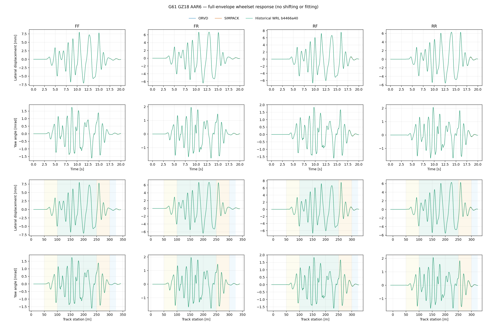
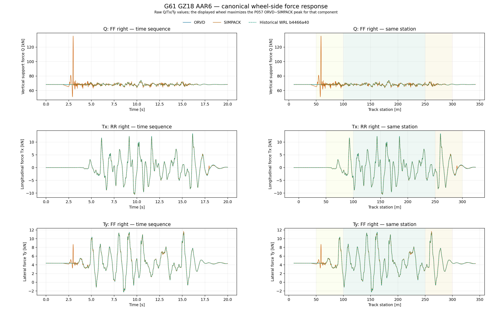
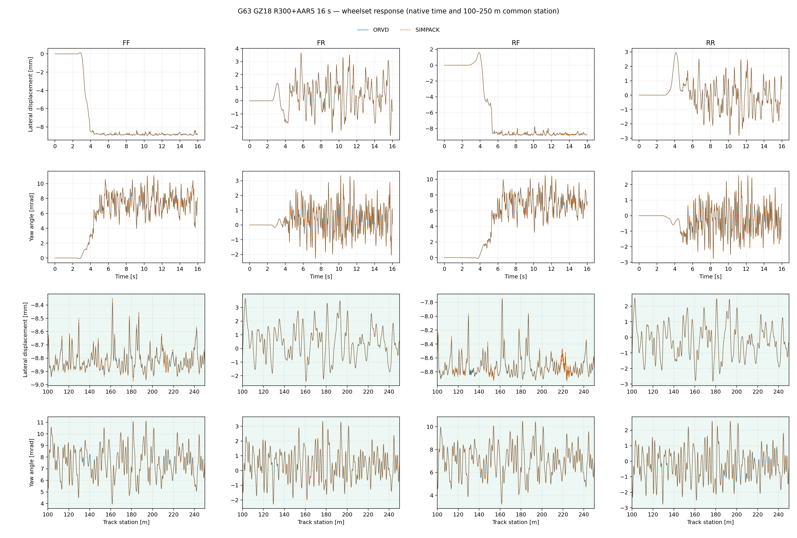
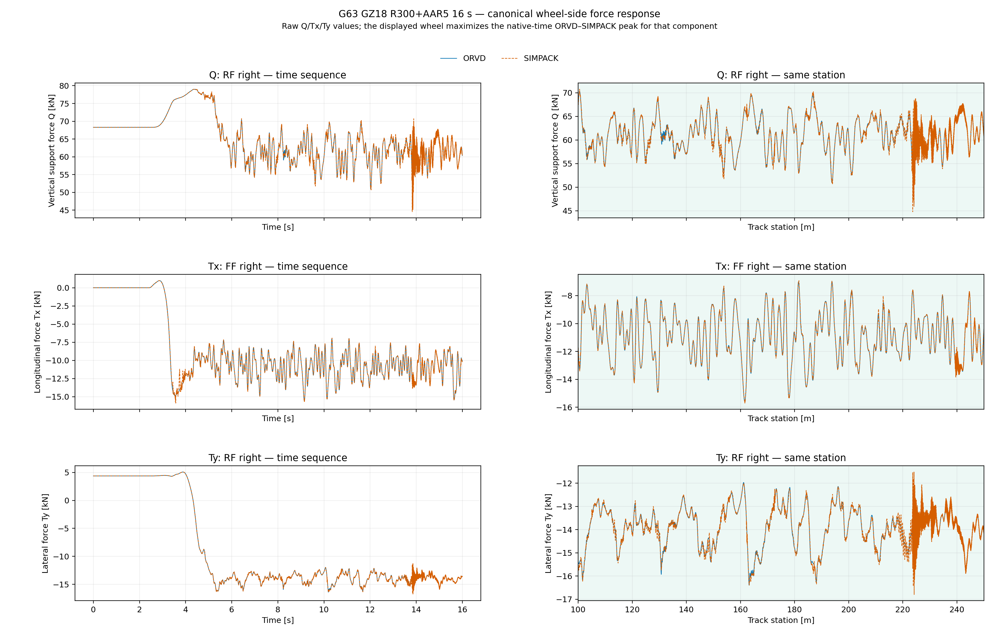

# OpenRailVehicleDynamics (ORVD)

模型中立、仅 `double`、以**零 Drake 运行期依赖**为目标的 C++ 多体运行时。

## 当前能力边界

ORVD 是面向轨道车辆的 C++23 双精度刚性多体动力学库。现已具备多体模型装配、运动学、质量矩阵、
逆动力学与前向动力学、外力投影、复合连续状态，以及基于 CVODE 的时域积分；同时提供严格 JSON
配置、可安装的 CMake 包和独立安装消费者验证。产品运行时不依赖 Drake。

轨道车辆功能包括轨道几何与站位投影、轮轨型面处理、轮轨接触几何、EEC 法向接触、
Kalker/FASTSIM 切向接触、悬挂与车辆力元、轨道不平顺，以及八个轮轨接口的确定性 OpenMP 并行计算。
GZ18 的 17 刚体模型、60 km/h 初始状态和轮轨接触已经接入车辆动力学方程。

当前资格范围已覆盖 GZ18 在直线、水平、零超高条件下的无轨道不平顺 10 ms 纵切，冻结 AAR6
输入的 10 s 激活窗和 20 s 完整包络，以及 R300+AAR5 16 s 曲线工况；四个轮对的横移、摇头、
站位与八轮接触力均已和 SIMPACK、WRL 作原生时序及同里程核对。轮轨力仍保留已知模型差异，
不能称为高精度闭合。IRW 已完成被动机械记录与装配：25 个非世界刚体、8 个独立车轮转动副、
8 个 Ball-RPY 球铰、8 个半角共同中点六分量衬套和两条 Maxwell 状态已形成 `nq=81`、`nv=74`
的安装态真实系统；H3 启动、轮轨接触、时域响应与控制仍未接入。实施顺序与完成条件见
[轨道车辆动力学迁移与重构路书](docs/planning/rail_vehicle_dynamics_migration/MIGRATION_ROADMAP.md)，
底层多体运行时的演进记录见
[Drake 多体运行时脱耦路书](docs/planning/DRAKE_MULTIBODY_RUNTIME_DECOUPLING_ROADMAP.md)。

## 目录结构

```text
OpenRailVehicleDynamics/
├── CMakeLists.txt        顶层构建与安装入口
├── CMakePresets.json     开发、发布与 Drake 参考构建预设
├── cmake/                CMake 辅助模块
├── distribution/         离线依赖源码包与超级构建模板
├── docs/
│   ├── planning/         实施路书、决策账本与观察记录
│   ├── adr/              架构决策记录
│   └── engineering/      第一方工程约束
├── external/
│   └── drake_mbtree/     vendored 刚性多体树源码、替代实现与许可证
├── libs/
│   ├── track_geometry/    轨道几何、轨道坐标系与站位投影
│   ├── wheel_rail_contact/ 型面、接触几何、法向／切向接触与工作区
│   ├── configuration/     严格 JSON 加载、车辆与初始状态装配
│   ├── multibody_runtime/ 多体状态、缓存与求值运行时
│   ├── multibody_model/   模型中立的多体建模接口
│   ├── forces/            车辆力元与轮轨接触力计划
│   ├── system_assembly/   系统装配与计算计划
│   └── integrators/       连续状态推进接口与 CVODE 后端
├── tools/
│   ├── dynamics_qualification/ 长窗动力学资格运行器（不安装）
│   ├── profile_conversion/     JSON 与 SIMPACK 型面格式转换工具（不安装）
│   └── drake_source_boundary/  Drake 源码边界检查工具
├── track_library/         轨道几何、轨型与轨道不平顺 JSON 资产
├── vehicle_library/       按车型组织的机械、启动与轮型 JSON 资产
│   ├── gz18/              GZ18 完整已资格资产
│   └── irw/               IRW 被动机械记录（启动与轮型待后续 Goal）
└── tests/                 单元、系统、安装与跨实现验证
```

公共头位于 `libs/<module>/include/orvd/<module>/`，实现位于相邻的 `src/`。安装包导出
`ORVD::track_geometry`、`ORVD::wheel_rail_contact`、`ORVD::configuration`、
`ORVD::multibody_runtime`、`ORVD::multibody_model`、`ORVD::forces`、
`ORVD::system_assembly` 与 `ORVD::integrators`；vendored Drake 类型和开发期工具不安装。

## 迁移主线

| 分册 | Goal | 目标边界 |
|---|---:|---|
| GZ18 首次短窗 | G47–G55 | 无轨道不平顺直线上的 `10 ms` 被动 CVODE 首次端到端闭环 |
| GZ18 不平顺长窗 | G56–G63 | 直线 AAR6 `10 s/20 s`、精度—性能联合基线，再分别关闭 R300 站位传播和 AAR5 `16 s` 响应 |
| IRW 被动 | G64–G72 | Ball-RPY、完整衬套、IRW 车型／启动／接触，以及无轨道不平顺 R300 与冻结 AAR5 两层 `30 s` |
| IRW 1 kHz 控制与交付 | G73–G81 | 八路构架—独立车轮纯力偶、简单 PID、同人格长窗、公开场景／输出和安装应用 |

G55 只表示“GZ18 首次短窗闭环”，不等于完整迁移，也不等于两车被动阶段闭环。长窗不进入默认
CTest，跨 WRL／SIMPACK 的长轨迹和完整统计工件留在版本控制之外；仓内只保留摘要指标、对比图、
解析关系、守恒、事务、严格输入合同和短真实消费者。Radau3、P179 的 100 Hz `bridge_proxy` 人格、
50 s 运行、SH17 与编组均不是当前主线。

## 已锁定的架构决策

| 决策 | 内容 |
|---|---|
| [ADR-0001](docs/adr/0001-vendor-tree-behind-allowlist.md) | 方案 B：先按允许清单 vendor Drake 刚性多体树与拓扑（仅 `double`），再逐步替换 |
| [ADR-0002](docs/adr/0002-single-authoritative-context.md) | 单一权威 Context：状态只有一个所有者，树与子系统均为零复制视图 |
| [ADR-0003](docs/adr/0003-abstract-advancer-cvode-first.md) | 抽象推进器接口，首版唯一后端为 CVODE |
| [ADR-0004](docs/adr/0004-focused-dynamics-qualification.md) | 多模型本地性质门，单个高耦合在线漂移门 |
| [ADR-0005](docs/adr/0005-bind-wheel-rail-low-level-strategies-by-vehicle.md) | 按车型绑定两处轮轨低层策略，禁止运行期混搭 |

## 数值验收口径

- 条件良好的 `double` 跨实现连续量默认采用 `1e-8` 相对误差。
- 近零量使用按单位声明的绝对限。
- 旋转使用 `1e-8 rad` 的 SO(3) 测地角。
- 代数恒等式、有限差分与迭代求解分别使用与其误差来源相符的判据，不套用一个万能阈值。
- 车辆长窗与 SIMPACK 的比较同时检查时序和里程序列。每个工况使用一张由子图组成的主响应图，
  展示 4 个轮对的质心轨道横向位移与摇头角；每个子图只叠加 ORVD、SIMPACK 两条曲线，需要历史
  WRL 控制列时最多三条。
- 均方根、最大值和分段统计用于量化与定位，不单独决定工况成败；还须检查相位、局部峰值、激活区段、
  接触力和动力学残差，避免低均方根掩盖局部错误，也避免仅凭一个汇总数否决可解释差异。
- `5/10/30 s` 级运行同时报告实际墙钟、动力学推进实时因子、端到端实时因子及分段耗时；不从起步
  无轨道不平顺的快速区段线性外推进入不平顺后的全程性能。实时或快于实时是明确的优化目标，但不以
  牺牲已资格响应为代价。
- 不保存数值金标、输出快照或文件哈希；不要求逐位一致。
- 参考端与候选端始终位于不同进程：`libdrake.so` 导出的符号与 vendored 副本同处
  `namespace drake`，同进程链接会构成 ODR 违规，其最可能的症状是一次看起来通过的比较。

## 外置第三方

Eigen 3.4.0、fmt 9.1.0、nlohmann/json 3.12.0、OpenMP C++ 运行时与精确版本 SUNDIALS 7.7.0
是当前产品的构建
依赖，缺失时配置立即失败。开发构建可通过标准 CMake 搜索前缀提供依赖；离线源码包携带 OpenMP
之外四个非工具链依赖的具名官方归档与许可证，由同一具备 OpenMP C++ 支持的工具链安装到私有
前缀后仍经唯一的 `find_package()` 路径消费。
SUNDIALS 自身只启用 CVODE 软件包、串行向量和稠密求解所需目标，关闭其 OpenMP、MPI、BLAS、
LAPACK 后端；ORVD 的 OpenMP 消费者是 GZ18 八接口轮轨接触批，而不是 SUNDIALS。上游无条件
构建的基础模块不作私有补丁裁剪。nlohmann/json 只编译进配置实现，不进入
公共头或安装包依赖。Ceres 尚无消费者，因此不查找、不设选项、
不进源码包。

## 构建与安装

已有依赖前缀时可直接安装并由外部工程消费：

```bash
cmake -S . -B build -G Ninja \
  -DCMAKE_BUILD_TYPE=Release \
  -DCMAKE_PREFIX_PATH=<dependency-prefix> \
  -DCMAKE_INSTALL_PREFIX=<orvd-prefix> \
  -DBUILD_TESTING=OFF
cmake --build build
cmake --install build
```

外部 CMake 工程使用 `find_package(OpenRailVehicleDynamics CONFIG REQUIRED)`，按所需最高层链接
例如 `ORVD::integrators`。无需包含源码树、vendored Drake 头或接入层头。

不依赖系统开发包的离线方式见
[`distribution/dependencies/README.md`](distribution/dependencies/README.md)：开发者先用显式工具
组装源码包，普通使用者只需 CMake、C/C++ 工具链和构建器即可完成全部依赖与 ORVD 的构建安装。
该机制已经在 Ubuntu 24.04 上以 GCC 13 和 Clang 18、在 Windows 10 上以 Visual Studio 2019
16.11 / MSVC 19.29 运行同一真实 CVODE 消费者。Windows 构建还验证了迁移后的安装前缀、
运行期依赖闭包与 Drake 标记动态库阳性对照。

## GZ18

GZ18 是车辆迁移的首个真实车型消费者。源码中的稳定产物包括随包线路几何与 GZ18 车型记录、十七体
多体装配、复合连续状态与车辆力元、60 km/h 已解析移动启动、型面基础设施、单接口接触核心，以及随包
JSON 型面和类型化接触人格。八个 GZ18 轮轨接口现已作为系统装配期冻结的类型化力源进入每次直接
RHS；四个轮对载体的投影站位已在每个 CVODE 成功内部端点更新，并只随公开接受事务提交。八个
接口在载体运动学完成后使用每接口独占工作区确定性并行求值，结果仍按冻结轮序发布；标准 OpenMP
进程环境控制可用线程数，产品内部上限为八，不提供车型级线程策略接口。

G55 已建立无轨道不平顺直线 `10 ms` 的首次闭环。冻结横／垂不平顺已作为独立站位场进入轨型
位姿与接触角；活动刚性型面人格保持零轨侧材料速度。G60/G61 已完成直线 AAR6 `10 s` 激活窗与
`20 s` 完整包络的精度—性能基线。G62/G63 又完成了 R300 线路、P040 AAR5 无损资产、
`16 s` 站位与宏观响应资格，以及轮轨力诊断。历史报告中的
`4.9 mm RMS / 16 mm max` 来自 SIMPACK 轨型参考标记站位与历史 WRL 轮对刚体原点投影的
跨语义比较，不能解释为纵向传播误差。G62 分开两条同义观察链后，ORVD 相对 SIMPACK 的同时间
轨型参考站位误差为 `1.67–1.75 mm RMS / 5.18–6.66 mm max`，同里程首个原生样本到达时间
误差不超过一个 `0.5 ms` 采样周期；该残差已登记，尚不称为高精度闭合。

### 已完成的 GZ18 工况

当前已完成以下四项真实车辆计算：

- **直线基础工况（10 ms）**：直线、水平、零超高、无轨道不平顺，完成 GZ18 多体系统、车辆力元、
  八轮接触和时间积分器的首次端到端闭环。
- **直线 AAR6 激活窗（10 s）**：接入冻结的横向与垂向 AAR6 轨道不平顺，核对激励开始后的传播及
  四轮对横移、摇头响应。
- **直线 AAR6 完整包络（20 s）**：从 `t=0` 独立连续运行，覆盖激励前、淡入、全幅、淡出和恢复区段，
  形成当前直线不平顺长窗的精度与性能基线。
- **R300+AAR5 曲线工况（16 s）**：接入半径 `300 m` 的曲线线路和冻结 AAR5 轨道不平顺，完成线路站位、
  四轮对横移与摇头响应资格，并保留八轮轮轨力诊断。

四项工况均以 `60 km/h` 启动。`10 ms` 基础工况按 `0.1 ms` 原生时间序号比较；其余三个长窗采用
`0.5 ms` 观察周期，并按原生时间序号或原生样本越站时刻比较。全部结果均不作移时、插值、滤波、
拟合、缩放或去均值。

#### 直线 AAR6 20 s 完整包络



四轮对横移与摇头的同里程分段统计如下。均方根列取五个物理区段中的最差值，而不是全程平均；
最大值为全部区段的峰值。

| 响应量 | ORVD–SIMPACK 最差分段均方根 | ORVD–SIMPACK 最大差 | ORVD–历史 WRL 最大差 | 资格结论 |
|---|---:|---:|---:|---|
| 轮对质心轨道横向位移 | `38.10 µm` | `93.46 µm` | `0.0767 µm` | 通过 `0.1 mm` 门 |
| 轮对摇头角 | `11.86 µrad` | `36.51 µrad` | `0.0325 µrad` | 通过 `0.1 mrad` 门 |



三向力图展示规范轮侧的竖向支承力 `Q`、纵向力 `Tx` 与横向力 `Ty`；每一行选取该分量
ORVD–SIMPACK 峰值最大的轮位。法向力 `N` 不是轨道坐标系中的第四个方向，因此不重复绘图，但保留
在表内。力的均方根按全部 `40001×8` 个接口样本计算；这些量目前是诊断观察，不是 G61 合格门。

| 力分量 | ORVD–SIMPACK 全窗均方根／最大差 | 峰值时 ORVD／SIMPACK | 峰值位置 | ORVD–历史 WRL 最大差 |
|---|---:|---:|---|---:|
| `Q` | `1.642 / 67.111 kN` | `68.254 / 135.365 kN` | 前构架前轴右轮，`2.9910 s / 58.95 m` | `12.4 N` |
| `N` | `1.639 / 66.971 kN` | `68.123 / 135.094 kN` | 前构架前轴右轮，`2.9910 s / 58.95 m` | `12.3 N` |
| `Tx` | `0.0865 / 1.564 kN` | `−0.864 / +0.700 kN` | 后构架后轴右轮，`17.9495 s / 290.03 m` | `3.79 N` |
| `Ty` | `0.111 / 4.351 kN` | `+4.345 / +8.696 kN` | 前构架前轴右轮，`2.9905 s / 58.94 m` | `4.20 N` |

宏观车辆响应已经通过；轮轨力仍复现 P057 中历史 WRL 相对 SIMPACK 的既有尖峰，因此不能据此宣称
轮轨力已高精度闭合。八线程 20 s 科学运行的总墙钟为 `287.998 s`、端到端实时因子为 `0.06944`、
峰值常驻内存约 `83.0 MiB`；进入全幅和淡出段后明显慢于无轨道不平顺的起步段。

#### R300+AAR5 16 s 曲线响应



主门在四轴各自的 `100–250 m / 0.01 m` 同里程格上比较 ORVD 与 SIMPACK；下表同时列出
均方根和最大差。四轴均方根均通过 `0.1 mm / 0.1 mrad` 目标。后构架前轴在约 `223 m`
出现两个短窄峰：横移超线最长 `0.09 m`，摇头超线最长 `0.03 m`；它们如实保留，不由单个
最大值否决整个 16 s 工况。

| 轮对 | 横移均方根／最大差 | 摇头均方根／最大差 |
|---|---:|---:|
| 前构架前轴 | `9.93 / 41.57 µm` | `6.82 / 36.10 µrad` |
| 前构架后轴 | `6.49 / 17.85 µm` | `5.88 / 24.73 µrad` |
| 后构架前轴 | `18.62 / 113.34 µm` | `15.69 / 103.12 µrad` |
| 后构架后轴 | `6.98 / 19.72 µm` | `5.37 / 20.86 µrad` |



在本次 `16 s` 三方工件中，八轮全程均为单斑接触，没有持续失联或长期零力；该观察不外推为
安全资格或通用单斑合同。轮轨力只作诊断观察；ORVD–SIMPACK
原生时序的全接口均方根／最大差如下。当前 WRL 相对 SIMPACK 的对应 `N/Tx/Ty` 差异量级与 ORVD
相近，而 ORVD 相对当前 WRL 仅为几十牛顿均方根，说明主要边界沿自编 WRL 路径继承，尚未完成
对 SIMPACK 的高精度闭合。

| 力分量 | ORVD–SIMPACK 全接口均方根／最大差 |
|---|---:|
| 轨道竖向支承力 `Q` | `0.409 / 12.119 kN` |
| 局部法向力 `N` | `0.414 / 12.199 kN` |
| 规范轮侧纵向力 `Tx` | `0.113 / 2.821 kN` |
| 规范轮侧横向力 `Ty` | `0.087 / 2.779 kN` |

本次 ORVD 八线程运行总墙钟为 `237.547 s`、端到端实时因子为 `0.06736`、峰值常驻内存约
`78.7 MiB`。同机当前 WRL 固定步长 Radau3 重跑为 `717.94 s / 0.02229 / 296.1 MiB`；该比较
只说明本次执行身份，且两端的积分器不同。当前 WRL 与历史 P055 在共同样本上的横移、摇头和
`N/Tx/Ty` 近双精度一致，因此历史控制列没有掩盖近期实现漂移。

轮轨型面资产的边界：ORVD 随包发布本项目自有、自包含的 JSON 型面记录，它是运行时型面的唯一真源；
第一方设施同时提供与 SIMPACK `.prw/.prr` 的语义读写与双向转换（`tools/profile_conversion/`），
供本地科研核对使用。该兼容通路只实现资格化资产用到的那个子集，对它未实现的平移、镜像、旋转、
缩放与裁剪声明一律响亮拒绝，而不是默默忽略；直接 `.prw/.prr` 读写时，文件声明的有效遍历方向
被记录并同义写回。经过产品 JSON 后不保留 SIMPACK 专有元数据，再导出时按 ORVD 的规范型面角色
生成遍历声明；输出点行统一升序，方向若不另行承载就会在往返中被静默抹平。供应商型面文件不进入
本仓库、不随安装包发布，也不作为运行时权威；随包 JSON 型面资产已经落地。运行时以无扩展名的
逻辑标识经安装数据根解析 JSON；本地 `.prw/.prr` 只参加一次性语义互操作核对，不成为产品身份、数值金标
或第二份运行时输入。项目不依赖 CONTACT。

## IRW

IRW 是阶段一的第二个真实车型，而不是 GZ18 的参数变体。严格车型记录现已把冻结 WRL 的 25 个
非世界刚体、7 个自由体、8 个独立车轮转动副、8 个 Ball-RPY 纵向拉杆球铰、2 个焊接关系、
46 条普通悬挂和 2 个 Maxwell 通道装配成被动系统。构架侧固定衬套使用半角中间坐标系和共同中点
加载；它与 SIMPACK Type-43 的已知局部语义差异继续单独登记，不在首次迁移中混入第二套公式。
该车型的 `nq=81`、`nv=74` 与连续状态 157 只用于这份资格资产的完整性核对，不构成通用 ABI。

IRW 目前还没有 H3 已解析启动状态、自有型面与接触人格，也没有进入车辆 RHS 或控制系统；这些
分别由后续 Goal 接通。八个独立车轮自旋不会从四个轴桥载体推断，而始终由八个具名转动副表达。

IRW 被动主线沿用 C++＋CVODE 的逐次 RHS 接触求值，不迁移旧接触采样保持。A 层为无轨道不平顺的 R300
`30 s`，B 层为同一冻结 AAR5 `30 s`；两层都按每轴 `100–450 m` 的 `0.01 m` 公共站位格裁决。
WRL 在约 `3.659 s` 观测到连续 13 个 `100 µs` 样本仅 7 轮接触；后续 ORVD 拓扑观察结果将与它
并列报告，出现或不出现都不预设成逐样本金标。该边界不否决限定范围的宏观响应资格，也禁止声称
全时程八轮接触或安全资格。

控制主线是同进程 1 kHz 简单 PID 与八路转向架构架—独立车轮等大反向纯力偶。
历史 P179 的 100 Hz 全状态控制加普通 `bridge_proxy` 只是另一种研究人格，不能替代尚需生成的 1 kHz 同人格 SIMPACK Realtime
车辆长窗参考。Radau3 同样不是当前产品依赖或完成门。

## 许可证

项目负责人已允许非盈利用户使用、修改与再分发第一方代码；商业生产使用仍须另行授权。
正式许可证主体、法律文本和统一转换日期尚未落地，因此当前只陈述该使用边界，不把仓库称为
已经按标准许可证正式发布。计划中的正式文本为初期 BSL 1.1、三年后统一转 Apache-2.0。

已落位的 Drake 源码受 BSD-3-Clause 及其逐文件注明的 Apache-2.0 条款约束；被修改的
Apache-2.0 文件按第 4(b) 条携带改动声明。第三方与再分发说明见仓库根的
[`NOTICE`](NOTICE)，逐文件处置与来源事实见
[external/drake_mbtree/README.md](external/drake_mbtree/README.md)。
